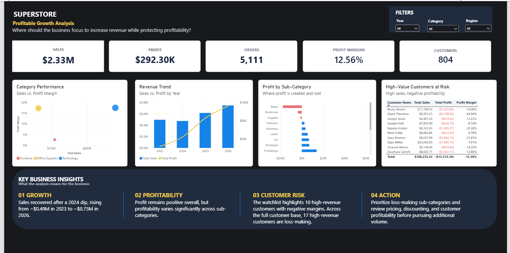

# Superstore — Profitable Growth Analysis

## Business Question

**Where should the business focus its efforts to increase revenue while protecting profitability?**

This project analyzes Superstore sales, profitability, customers, products, discounts, regions, segments, and returns to identify the drivers of profitable growth and areas of profit leakage.

---

## Project Overview

The analysis follows an end-to-end business analytics workflow:

**Business Question → Data Preparation → Exploration → Profitability Analysis → Risk Identification → Recommendations**

Three tools were used for different analytical purposes:

- **Excel** — structured business performance analysis and drill-down
- **Python** — deeper customer, product, growth, and discount-risk analysis
- **Power BI** — management-facing dashboard for monitoring performance and priorities

---

## Dataset

The project uses the Tableau Sample Superstore dataset.

### Core data

- 10,194 transaction records
- 5,111 unique orders
- 804 unique customers
- 2023–2026 analysis period

Supporting data includes regional manager information and return records.

---

## Key Business Findings

### 1. Revenue growth accelerated after 2024

Sales declined **4.26% in 2024**, followed by:

- **+29.80% in 2025**
- **+21.44% in 2026**

Profit also increased during the growth period, although profit growth slowed to **16.04% in 2026** from **33.29% in 2025**.

---

### 2. Technology and Office Supplies generate stronger margins

| Category | Sales | Profit | Margin |
|---|---:|---:|---:|
| Technology | $839.89K | $146.54K | 17.45% |
| Office Supplies | $731.89K | $126.02K | 17.22% |
| Furniture | $754.75K | $19.73K | 2.61% |

Furniture generates substantial revenue but significantly weaker profitability.

---

### 3. Tables are a major source of profit leakage

The Tables subcategory generated approximately:

- **$208.02K sales**
- **-$17.75K profit**
- **-8.53% margin**

Other loss-making subcategories include Bookcases and Supplies.

---

### 4. High-revenue customers can still be unprofitable

For this analysis:

- High-revenue customer = **at least $5,000 in sales**
- Profitability risk = **profit margin below 10%**

The analysis identified **33 customers** meeting these criteria.

Together, they generated approximately:

- **$254.25K in sales**
- **-$20.74K in profit**

A further subset of **17 high-revenue customers** generated negative profit margins.

---

### 5. Higher discounts are associated with weaker profitability

The analysis found weaker profitability at higher discount levels.

Transactions with discounts above 30% generated approximately:

- **$91.8K sales**
- **-$37.7K profit**

This represents a **theoretical break-even gap of approximately $37.7K**, not a forecast of recoverable profit.

---

### 6. Growth is driven by customer and order activity

Python analysis indicates that recent sales growth is primarily associated with:

- More customers
- More orders
- Higher orders per customer

while average order value declined.

This suggests that sales growth should be evaluated alongside the quality and economics of customer and order growth.

---

### 7. Regional profitability varies

The West region recorded the highest regional margin at approximately **14.98%**, while Central recorded approximately **7.92%**.

State-level analysis also identified several loss-making markets requiring further investigation.

---

## Business Recommendations

Based on the analysis:

1. **Prioritize profitable growth** rather than revenue growth alone.
2. **Review Furniture economics**, particularly Tables and other loss-making subcategories.
3. **Investigate loss-making products** for pricing, discounting, and cost-related issues.
4. **Review high-revenue, low-margin customer relationships** to understand their profitability drivers.
5. **Tighten discount decisions**, particularly at higher discount levels.
6. **Investigate regional and state-level loss patterns** before scaling sales further in those markets.
7. Use Power BI to monitor growth, profitability, and emerging profit-leakage areas.

---

## Dashboard



The Power BI dashboard provides an executive view of:

- Sales and profit growth
- Category profitability
- Subcategory profit leakage
- High-value customer profitability risk
- Overall business KPIs

---

## Project Structure

```text
superstore-profitable-growth-analysis/
│
├── README.md
│
├── notebooks/
│   └── Superstore_Growth_Analysis.ipynb
│
├── excel/
│   └── Superstore_Analysis.xlsx
│
├── powerbi/
│   └── Superstore_Profitable_Growth.pbix
│
└── screenshots/
    └── dashboard.png
